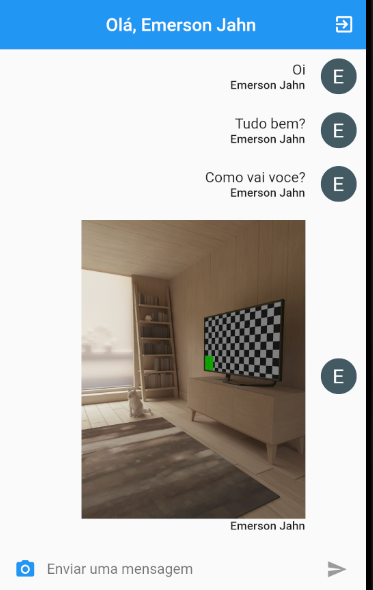

# Chat

 

### Chat is a simple chat application.

### Application developed in the course [Criação de Apps Android e iOS com Flutter - Crie 16 Apps](https://www.udemy.com/course/curso-completo-flutter-app-android-ios/).

 

### Technologies:
- FLutter
- Dart

 

### Preview

 
 

### Developer
<a href="https://github.com/EmersonJahn">

 

<b>Emerson Jahn</b></a> 

 
 
 

 
